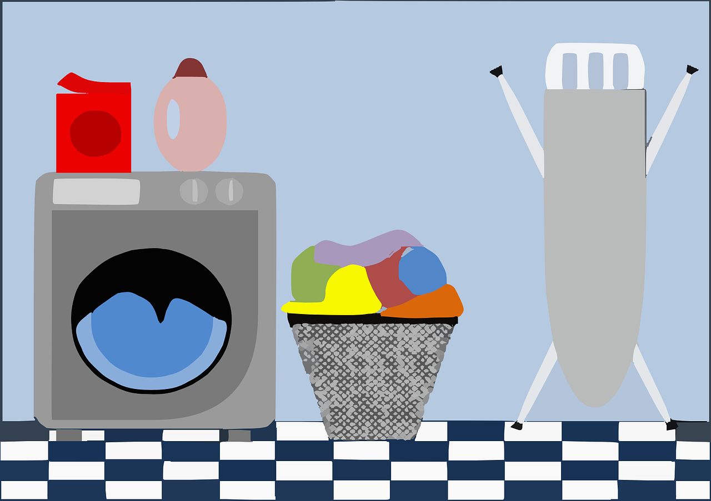
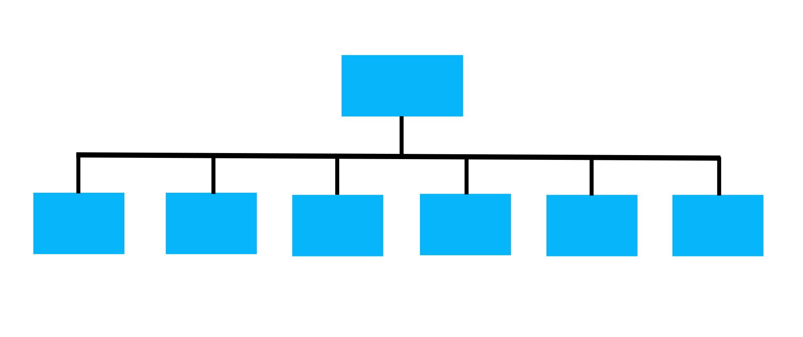
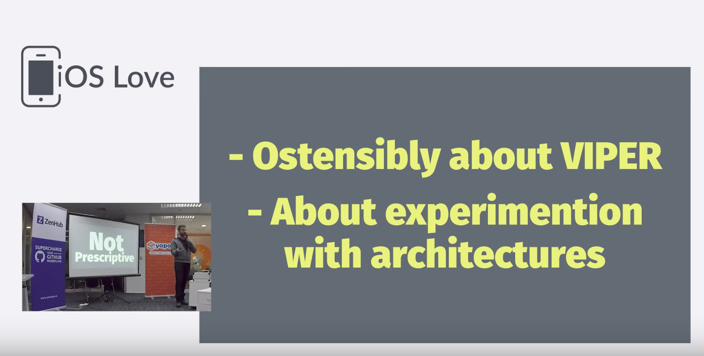
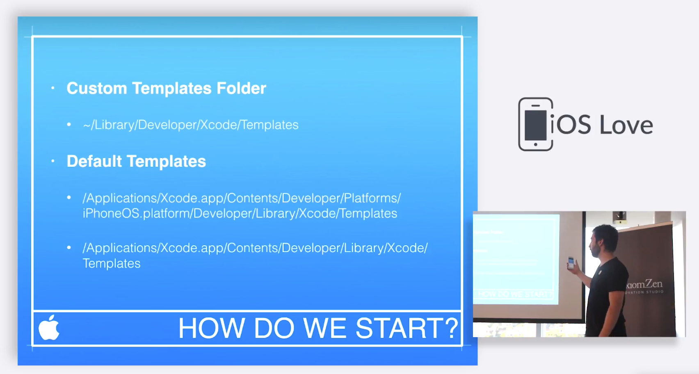

# Move **fast** 
## and keep your **code quality**

---

---

## This talk 
# **is not about**
## faster development

---

## This talk 
# **is about**
## quality

---

# Productivity 
## is a **by-product**
# of Quality

----

## ⚠️ FAIR WARNING ⚠️

---

# Not for lone wolfs 🐺

^ This talk is not for people working by themselves.

---

# My journey
## This is not a scientific talk

^ In this talk I'll discuss my journey and my thoughts about iOS development in particular and how to create good code in general.
^ This has worked for my, with my background.
^ I haven't done any scientific research on this, so this is prueley based on experience.

---

# Parts of 
## this talk _probably_
# **don't** scale 

^ That's why parts of this talk don't scale.

---

# And I'm OK 👌 
## with that

^ Not all of us work in big companies.
^ I'm sharing what works for me and for us as a company.
^ Maybe you could relate
^ If something is working, keep doing it. If you grow, refine.

---

## These are
# **not** rules

^ I'm not trying to come up with a set of rules

---

## Chapter zero
# **Quality**

---

# Productivity 
## is a **by-product**
# of Quality

---

---

# Option **A**

---

## Work faster
## **Lose product quality**

---

# Option **B**

---

## Work longer
## **Lose life quality**

---

# Option **C**

---

---

> Look at all these shitty lines of code I wrote today!
-- No one, ever.

---

## We're proud about the **quality of our work**
### Not the quanity

---

### **Less quality**
## More production bugs

---

# More bugs
## **less productivity**

---
 [^1]

[^1]: [Integrating Software Assurance into the Software Development Life Cycle (SDLC)](https://www.researchgate.net/publication/255965523_Integrating_Software_Assurance_into_the_Software_Development_Life_Cycle_SDLC)

^ Defects found in testing were 15 times more costly than if they were found during the design phase and 2 times more than if found during implementation.

---

# 100x

---

### Spaghetti code
## **More time per new feature**

---

# More time per feature 
## **less productivity**

---

# Quality means 
## **fewer bugs**

---

# Quality means 
## **faster feature cycles**

---

## Who's in charge?

---

## Quality is not *QA* responsability

---

## Quality is a 
# **company wide** 
## effort

---

## Chapter one
# **The company**

---

# 2010

^ I started doing iOS development in 2010
^ And when I started there I had a list of things I'd like for the place where I was going to work to have.

---

# Early 20s

^ Tha means I started working as a professional developer in my early 20s.

---

# Must haves

---

^ A ping pong table. 
^ Because they're cool.

---

^ A foosball table.
^ Because they're cool.

---

^ I didn't wanna have to work in a suit.
^ Becuase, you know, they're not cool.

---

# Nice to have

^ And something that would be nice to have, but I don't really need it.

---

^ Is beer on tap.
^ But you know, that's a stretch goal.

---

# Startup!

^ So, as you're probably guessing.
^ I entered the startup world.

---

^ Some companies even clean your house a couple of times a month for you!

---

^ And others do your laundry!

---

## That's ridiculous

^ I'm a grown man. I can do my own laundry.

---

### Great work environments 
## don't need perks as **bribes** [^2]

[^2]: [5 Ridiculous Employee Perks That Could Backfire](https://www.inc.com/jt-odonnell/5-over-the-top-employee-perks-that-could-backfire.html)

---

## No increase 
# in the **quality** 
## of the product. 

---

## It just makes people 
# **stay** at work **longer**

---

## How many hours 
# you **worked in something**

---

## How much of something 
# you **did in an hour**

---

# I'm 30
## What do I value in a company?

---

## Promotes 
#Personal Growth

---

## Space for 
# Learning

---

# Work-Life balance

---

^ I don't wanna become a manager

---

# **Direct impact**
## in the _quality_ of the product

---

^ So looking for this kind of things in 2015 I joined Axiom Zen.
^ So how does Axiom Zen promote the things I'm looking for?

---

# Follow the money

^ Where is the money being spent?
^ Is it being spent on all this perks that I discussed?
^ Or is it being spent on other areas? What are those?

---

# Travel to conferences

^ At Axiom Zen we ask for people to go to conferences. We paid for their plane tickets and accomodations.

---

# Speak at conferences

^ We particularly encourage people to speak at these conferences.

---

# Access to 
## books, courses, learning material

---

## Allocate time to
# **study**

^ As a developer you need to be learning constantly
^ I want to work for a company that not only recognizes, but promotes it allocating work time for this.

---

## Work in a company 
# that **values quality**

---

## Chapter two
# **The Project**

---

---

# Flat hierarchy?

---

---

# Flat hierarchy 
# is a **lie**

---

^ This is what happens

---

### This is 
## **informal** leadership [^*]

[^*]: [Cut the bullshit: organizations with no hierarchy don’t exist](https://medium.com/ouishare-connecting-the-collaborative-economy/cut-the-bullshit-organizations-with-no-hierarchy-dont-exist-f0a845e73a80)

---

# If everybody is reponsible
## no one is responsible.

---

# Make it explicit

---

### We don't have managers
# We have **keepers**

^ A manager is a decision making role.
^ A keeper is a safety role.
^ A keeper is a facilitator, coordinator.

---

# Who's in charge?

---

# What is **quality**?

---

## Good definition of
# **requirements**

^ Peopleware

----

## Requirements are met 
# Good Quality

---

## Spend time thinking 
# what do to

---

# Short iterations

---

# Context switching

---

> When interrupted, it takes an average of 23 minutes and 15 seconds to get back to the task. [^3]

[^3]: [Worker, Interrupted: The Cost of Task Switching](https://www.fastcompany.com/944128/worker-interrupted-cost-task-switching)

---

# Work like you're remote.

---

# Rely on async tools

---

## Chapter three
# **The Team**

---

# Teams are more important than projects

---

## It's hard to form 
# a good team. 
### If it works, keep doing it!

---

# Form projects around teams
## **not the other way around**

---

## A good team will continue being a good team
### regardless of the project

---

# Creating good teams

---

# Sharing knwoledge

---

# Study groups

^ Every week we allocate 1 hour for our iOS study group.
^ In there we discuss different topics
^ We agree on standards
^ We share what we worked on last week
^ We discuss everything

---

# Pull Requests and Code Reviews

^ These is one of the best ways to share knowledge

---

---

---

---

# Architecture

---

[^4]

[^4]: [What comes after VIPER? by Steve Powell](https://youtu.be/B30rHcVXfO8)

---

# Xcode Templates

---

[^5]

[^5]: [Xcode Templates por Camilo Vera](https://youtu.be/_ywYG9tN12w)

---

# Chapter four
## **The Developer**

---

# Story time!
## Wisdom teeth removal

---

---

# Option **D**

---

# Say **no** [^6]

[^6]: Robert C. Martin - The Clean Coder

---

# Be professional

^ Equally as what happened with my dentist. The professional thing to say is No.
^ If the scope is too big. Say no.
^ If there's not enough time. Say no.

---

> "But we really, really need this by friday"
-- Someone, right now.

^ If the stakes are high, then specially this is the moment to say no. If we really really need this for friday we need to be clear and professional to tell immediately when something is going wrong.

---

# 

---

# Be ethical

---

# Conclusion

---

## Increase productivity
# Move faster

---

# Increased quality
## Increased productivity

---

# Focus on 
# **Quality first**

---

# There's no silver bullet

---

# Company **quality**

---

# Project **quality**

---

# Team **quality**

---

# Be a **professional** developer

---

# TLDR

---

---

# The End	 🍻

### @fco_diaz
