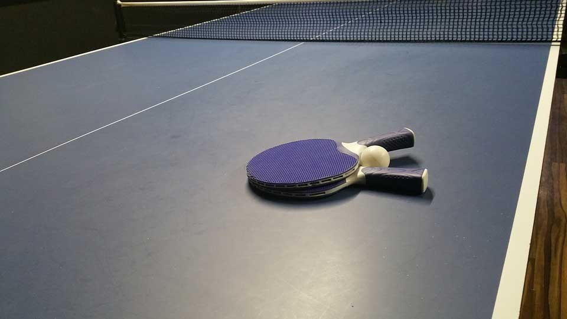
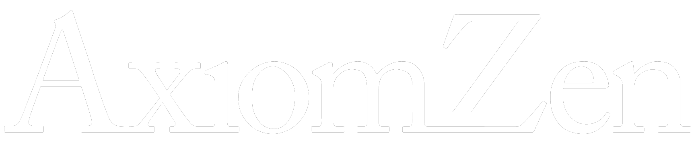

# Move **fast** 
## and keep your **code quality**

---

# SPOILER

---

## This talk 
# **is not about**
## fast development

---

## This talk 
# **is about**
## quality

---

# Productivity 
## is a by-product 
# of Quality

----

## ⚠️ FAIR WARNING ⚠️

---

# Not for lone wolfs 🐺

^ This talk is not for people working by themselves.

---

# My journey
## This is not a scientific talk

^ In this talk I'll discuss my journey and my thoughts about iOS development in particular and how to create good code in general.
^ This has worked for my, with my background.
^ I haven't done any scientific research on this, so this is prueley based on experience.

---

# Parts of 
## this talk 
# **don't** scale 

^ That's why parts of this talk don't scale.

---

# And I'm OK 👌 
## with that

---

## These are
# **not** rules

^ I'm not trying to come up with a set of rules

---

## Chapter zero
# Quality

---

# I need this done by friday

---

## Work faster
## Lose quality

---

# We're proud about the quality of our work
## Not the quanity

---

# Quality gives happiness and cozy feelings

---

# Less quality == More bugs

---

# More bugs == less productivity

---

# Spaghetti code == More time developing new features

---

# More time per feature == less productivity

---

# Quality means fewer bugs
# Quality means faster development cycles

---

# Quality means better code, easier to implement new features

---

# Quality means better project managment

---

# Quality is not the QA responsability, is everybody's

---

# Build it right the first time!

---

# Think of the market!

---

## Chapter one
# **The company**

---

# 2010

^ I started doing iOS development in 2010
^ And when I started there I had a list of things I'd like for the place where I was going to work to have.

---

# Early 20s

^ Tha means I started working as a professional developer in my early 20s.

---

# Must haves

---

^ A ping pong table. 
^ Because they're cool.

---

^ A foosball table.
^ Because they're cool.

---

^ I didn't wanna have to work in a suit.
^ Becuase, you know, they're not cool.

---

# Nice to have

^ And something that would be nice to have, but I don't really need it.

---

^ Is beer on tap.
^ But you know, that's a stretch goal.

---

# Startup world!

^ So, as you're probably guessing.
^ I entered the startup world.

---

# All that glitters is not gold

---

# I don't want
## to work in a place that 
## cleans my laundry.

---

# This doesn't increase the quality of the product. It just makes people stay longer at the workplace.

---

# How many hours you worked in something vs how much of something you did in an hour.

---

# I'm 30. What am I looking now?

---

# Promotes Personal Growth

---

# Space for Learning

---

# Work-Life balance

---

# Has a clear path of growth as a developer.

^ I don't wanna become a manager

---

# This things have a direct impact in the quality of the product

---

^ So looking for this kind of things in 2015 I joined Axiom Zen.
^ So how does Axiom Zen promote the things I'm looking for?

---

# Follow the money

^ Where is the money being spent?
^ Is it being spent on all this perks that I discussed?
^ Or is it being spent on other areas? What are those?

---

# Travel to conferences

^ At Axiom Zen we ask for people to go to conferences. We paid for their plane tickets and accomodations.

---

# Speak at conferences

^ We particularly encourage people to speak at these conferences.

---

# Easy access to books, courses, learning material.

---

## Allocate time to
# **study**

^ As a developer you need to be learning constantly
^ I want to work for a company that not only recognizes, but promotes it allocating work time for this.

---

# Work in a company that values Quality

---

## Chapter 2:
# Projects

---

# What is quality?

---

# Good definition of requirements

^ Peopleware

----

# Requirements are met == Good Quality

---

# What do to. Why?

---

# Flat hierarchy?

---

# Flat hierarchy 
# is a **lie**

---

# This is what happens

---

# This is informal leadrship

---

# If everybody is reponsible
## no one is responsible.

---

# Make it explicit

---

### We don't have managers
# We have **keepers**

^ A manager is a decision making role.
^ A keeper is a safety role.

---

# Transparency & Clarity

---

# Work like you're remote.

---

# Rely on Async tools

---

## Chapter 3:
# Team

---

# Teams are more important than projects

---

# Is hard to form a good team. If it works, keep doing it!

---

# Form projects around teams, not the other way around.

---

# A good team will continue being a good team, regardless of the project.

---

# Enforcing quality

---

# Study groups

---

# Pull Requests and Code Reviews

---

# Code reviews are NOT to review syntax

## There's a small thing called a Linter y'know?

---

# Automate all the things!

---

# Xcode templates

---

# Snippets

---

# Chapter 4:
## The Developer

---

# Wisdom teeth removal

---

# Say no

---

# Be professional

---

# Conclusion

---

# Increase productivity == Move fast

---

# Increased quality == increased productivity

---

# Focus on Quality first.

---

# There's no silver bullet

---

# Company quality
# Project quality
# Team quality
# Be a professional Developer

---

# Danke schön 🍻

### github.com/fdiaz/move-fast-talk
### @fco_diaz
