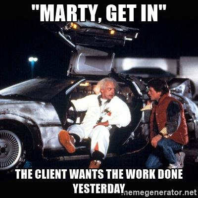
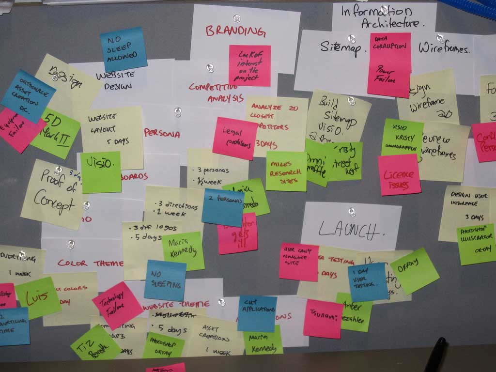

# [fit] Move _**fast**_
## [fit] and keep your _**code quality**_

---

---

## [fit] This talk 
# [fit] _**is not about**_
## [fit] faster development

^ No new tools
^ Not a speed reading course

---

## [fit] This talk 
# [fit] _**is about**_
## [fit] quality

---

# [fit] Productivity 
## [fit] is a _**by-product**_
# [fit] of Quality

^ This is the premise of my talk. And I'll explore this in further detail later on in a bit.

----

## [fit] ⚠️ _**FAIR WARNING**_ ⚠️

^ But first a warning.

---

# [fit] Not for 
# [fit] lone wolfs 🐺

^ This talk is not for people working by themselves.
^ Not for freelancers
^ Not for single person companies.

---

# [fit] _**My experience**_
## [fit] Not a scientific paper

^ In this talk I'll discuss my journey and my thoughts about iOS development in particular and how to create good code in general.
^ This has worked for my, with my background.
^ I haven't done any scientific research on this, so this is purely based on experience.

---
# [fit] Francisco 
# [fit] Díaz

# _**franciscodiaz.cl**_
# @fco_diaz

^ I'm Francisco
^ I'm 30
^ I started doing iOS Development in 2010
^ Santiago, Chile

---

^ I work at Axiom Zen.
^ We're currently around 60 people
^ Between 5-10 iOS developers
^ We strive for quality.

---

## Chapter zero
# **Quality**

---

# [fit] Productivity 
## [fit] is a _**by-product**_
# [fit] of Quality

---

^ Meet Mark.
^ Mark is a Manager.
^ The story goes like this...
^ On Monday Mark approaches you...

---

# Option **A**

---

## [fit] Work faster
## [fit] _**Lose product quality**_

^ Don't wait for CI
^ No PR
^ No design

---

# Option **B**

---

## [fit] Work longer
## [fit] _**Lose quality of life**_

^ Work for a living - Living to work
^ Burndown

---

# Option **C**

---

---

> Look at all these shitty lines of code I wrote today!
-- No one, ever.

^ Quien se jacta de esto?

---

## [fit] We're proud about 
## [fit] the _**quality of our work**_
### [fit] Not the quantity

^ Elegante
^ Proud developer creates better work

---

### [fit] _**Less quality**_
## [fit] More production bugs

---

# [fit] More bugs
## [fit] _**less productivity**_

---
 [^1]

[^1]: [Integrating Software Assurance into the Software Development Life Cycle (SDLC)](https://www.researchgate.net/publication/255965523_Integrating_Software_Assurance_into_the_Software_Development_Life_Cycle_SDLC)

^ Defects found in testing were 15 times more costly than if they were found during the design phase and 2 times more than if found during implementation.

---

# [fit] 100x

---

### [fit] Spaghetti code
## [fit] _**More time per new feature**_

---

# [fit] More time per feature 
## [fit] _**less productivity**_

---

# [fit] Quality means 
## [fit] _**fewer bugs**_

---

# [fit] Quality means 
## [fit] _**faster development**_
## [fit] per feature

---

## [fit] Who's in charge?

---

## [fit] Quality is _**not**_
## [fit] QA's responsibility

---

## [fit] Quality is a 
# [fit] _**company wide**_
## [fit] effort

---

## Chapter one
# **The company**

---

# [fit] 2010

^ I started doing iOS development in 2010
^ And when I started there I had a list of things I'd like for the place where I was going to work to have.

---

# [fit] Early 20s

^ Tha means I started working as a professional developer in my early 20s.

---

# [fit] Must haves:

---

^ A ping pong table. 
^ Because they're cool.

---

^ A foosball table.
^ Because they're cool.

---

^ I didn't wanna have to work in a suit.
^ Becuase, you know, they're not cool.

---

# [fit] Nice to have:

^ And something that would be nice to have, but I don't really need it.

---

^ Is beer on tap.
^ But you know, that's a stretch goal.

---

# [fit] Startup!

^ So, as you're probably guessing.
^ I entered the startup world.
^ I've discovered more perks

---

^ Some companies even clean your house a couple of times a month for you!

---

^ And others do your laundry!

---

## That's ridiculous

^ I'm a grown man. I can do my own laundry.

---

### [fit] Great work environments [^2] 
## [fit] don't need perks
## [fit] as _**bribes**_ 

[^2]: [5 Ridiculous Employee Perks That Could Backfire](https://www.inc.com/jt-odonnell/5-over-the-top-employee-perks-that-could-backfire.html)

---

## [fit] No increase 
# [fit] in the _**quality**_
## [fit] of the product

---

## [fit] It just makes people 
# [fit] _**stay**_ at work 
# [fit] _**longer**_

---

## [fit] How many hours 
# [fit] you _**worked in something**_

^ And this is not a good way to measure productivity

---

## [fit] How much of something 
# [fit] you _**did in an hour**_

^ A good measure for productivity is

---

# [fit] I'm 30
## [fit] What do I value in a company?

---

## [fit] Promotes 
# [fit] Personal Growth

---

## [fit] Space for 
# [fit] _**Learning**_

---

# [fit] Work-Life 
# [fit] _**balance**_

---

^ I don't wanna become a manager

---

# [fit] Follow the 
# [fit] money

^ Where is the money being spent?
^ Is it being spent on all these perks that I discussed?
^ Or is it being spent on other areas? What are those?
^ So where do we spend our money at Axiom Zen?

---

# [fit] Travel to 
# [fit] conferences

^ At Axiom Zen we ask for people to go to conferences. We paid for their plane tickets and accommodations.

---

# [fit] Speak at 
# [fit] conferences

^ We particularly encourage people to speak at these conferences.

---

# [fit] Access to 
## [fit] books, courses, learning material

---

## [fit]  Allocate time to
# [fit] _**study**_

^ As a developer you need to be learning constantly
^ I want to work for a company that not only recognizes, but promotes it allocating work time for this.

---

# [fit] _**Direct impact**_
# [fit] in the _**quality**_ 
# [fit] of your life/work

---

## [fit] Work in a company 
# [fit] that _**values quality**_

^ Not only the quality of the work you do
^ But also the quality of the life of their employers
^ Because that's going to have an impact in the quality of the projects you work on.

---

## Chapter two
# **The Project**

---

# [fit] Flat hierarchy?

---

# [fit] Flat hierarchy 
# [fit] is a _**lie**_

^ Natural roles of leadership
^ For experience, knowledge, etc.

---

### [fit] This is 
## [fit] _**informal**_ leadership [^3]

[^3]: [Cut the bullshit: organizations with no hierarchy don’t exist](https://medium.com/ouishare-connecting-the-collaborative-economy/cut-the-bullshit-organizations-with-no-hierarchy-dont-exist-f0a845e73a80)

---

# [fit] Make it _**explicit**_

---

# [fit] What does a 
# [fit] _**manager**_ look like?

^ A manager is usually a decision making role.
^ For us is a safety role.
^ For us is a facilitator, coordinator.
^ That's why we call them keepers

---

# [fit] More structure
## [fit] _**Distributed responsibilities**_

^ That means that is not only the manager role to 

---

# [fit] What is _**quality**_?

---

## [fit] Good definition of
# [fit] _**requirements [^4]**_

[^4]: Peopleware: Productive Projects and Teams by Tom DeMarco

----

## [fit] Requirements are met 
# [fit] _**Good Quality**_

---

# [fit] Short iterations

---

# [fit] Context switching

---

> # When interrupted, it takes an average of 23 mins to get back to the task. [^5]

[^5]: [Worker, Interrupted: The Cost of Task Switching](https://www.fastcompany.com/944128/worker-interrupted-cost-task-switching)

---

# [fit] Work like 
## [fit] _**you're remote**_

---

# [fit] Rely on 
# [fit] _**async**_ tools

^ You can be everywhere
^ Don't rely on other people being present
^ We have different offices.

---

## Chapter three
# **The Team**

---

## [fit] _**Teams**_ 
## [fit] are more important 
### [fit] than _**projects**_

---

## [fit] It's hard to form 
# [fit] _**a good team**_
### [fit] If it works, keep doing it!

^ That means..

---

# [fit] Form projects 
# [fit] around teams
## [fit] _**not the other way around**_

^ Bash experience
^ Camo, Fernanda.
^ A good team will continue being a good team regardless of the project

---

# [fit] _**Creating**_
# [fit] good teams

---

# [fit] Keep'em 
#### small

---

# [fit] Sharing knowledge

---

# [fit] Study groups

^ Every week we allocate 1 hour for our iOS study group.
^ In there we discuss different topics
^ We agree on standards
^ We share what we worked on last week
^ We discuss everything

---

# [fit] Standards

---

# Pull Requests
### _**and**_
# Code Reviews

^ These are one of the best ways to share knowledge

---

---

---

---

# [fit] Architecture

^ This is a talk in itself

---

 [^6]

[^6]: [What comes after VIPER? by Steve Powell](https://youtu.be/B30rHcVXfO8)

---

## [fit] Xcode 
# [fit] Templates

---

 [^7]

[^7]: [Xcode Templates por Camilo Vera](https://youtu.be/_ywYG9tN12w)

^ This talk is in Spanish
^ But Camo is here

---

# Chapter four
## **The Developer**

---

# [fit] _**Story time!**_
## Wisdom teeth removal

---

---

# Option **D**

---

# [fit] Say no [^8]

^ But explain why

[^8]: Robert C. Martin - The Clean Coder

---

# [fit] Be professional

^ Equally as what happened with my dentist. The professional thing to say is No.
^ If the scope is too big. Say no.
^ If there's not enough time. Say no.
^ Add more people, since you have standards.

---

> But we really, really need this by Friday
-- Someone, right now.

^ If the stakes are high, then specially this is the moment to say no. If we really really need this for friday we need to be clear and professional to tell immediately when something is going wrong.

---

# [fit] In summary...

---

# [fit] _**Move faster**_
## [fit] by ⬆️ your productivity

^ To move faster you need to increase your productivity

---

# [fit] ⬆️ productivity
## [fit] by increasing the
# [fit] _**quality**_

^ But to increase your productivity you need to increase the quality of what you're producing.

---

# [fit] Quality 
# [fit] _**first**_

^ Focus on quality first

---

# [fit] There's no silver bullet

^ But to get there, there's no silver bullet.

---

# [fit] Company

^ You need for the company to be focused on quality

---

# [fit] Project

^ You need for your project to be focused on quality

---

# [fit] Team

^ You need your team to be focused on quality

---

# [fit] Be a 
# [fit] _**professional**_ 
# [fit] developer

^ And you need to act as a professional.

---

# [fit] Danke schön

## @fco_diaz
## franciscodiaz.cl

*bennygiang, yasminenadery, callmenick, mackflavelle, aznick, fkenji, kcfitz, pierrebeugnot, azenMatt, kimcope, FerRZ, WrenHandman, camovrbz, guilegaspar, s-powell, pazams, alecmorgana, hexiumz, chrisaxiom, jfmaggie, EricLin2004, turbolent, roham, annatangzhao, Cassidy-Robertson, ziacastillo, kinhderella, acroca, dete, ni-ko1, danidiazreyna, arthurcamara1, Mathieuu, creedarky*